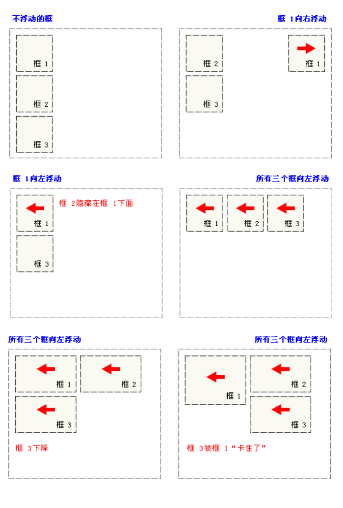

## CSS属性

```txt
属性：属性是指定选择符所具有的属性，它是css的核心，css2共有150多个属性
属性值：属性值包括法定属性值及常见的数值加单位，如25px，或颜色值等。
```
## 文本属性

##### 1:文本大小 font-size

```txt
说明：
	1） 属性值为数值型时，必须给属性值加单位，属性值为0时除外。
	2）单位还可以是pt，9pt=12px;
	3）为了减小系统间的字体显示差异，IE Netscape Mozilla的浏览器制作商于1999年召开会议，共同确定16px/ppi为标准字体大小默认值,即1em.默认情况下，1em=16px,0.75em=12px; rem
	4）使用绝对大小关键字
         xx-small =9px
         x-small =11px
         small =13px
         medium =16px
         large =19px
         x-large =23px
         xx-large =27px
```

##### 2:文本颜色  color

```txt
说明：

用十六进制(是计算机中数据的一种表示方法)表示颜色值：
	0 1 2 3 4 5 6 7 8 9
	0 1 2 3 4 5 6 7 8 9 A B C D E F
颜色模式：光色模式
	R G B
	FF 00 00
颜色值的缩写：
	当表示三原色的三组数字同时相同时，可以缩写为三位;
	当用十六进制表示颜色值时，需要在颜色值前加“#”
	# fa 00 00
```

##### 3:文本类型  font-**family**:字体1，字体2，字体3......

```txt
说明：
	浏览器首先会寻找字体1、如存在就使用改字体来显示内容，如在字体1不存在的情况下，则会寻找字体2，如字体2也不存在，按字体3显示内容，如果字体3 也不存在；则按系统默认字体显示；
	当字体是中文字体时，需加双引号；
	当英文字体中有空格时，需加双引号如（“Times New Roman”）
	当英文字体只有一个单词组成是不加双引号；如：（Arial）；
	Windows中文版本操作系统下，中文默认字体为宋体或者新宋体，英文字体默认为Arial.
```

##### 4:**文字加粗font-weight:bolder(更粗的)/bold（加粗）/normal（常规）/100—900;**

```txt
说明：

在css规范中，把字体的粗细分为9个等级，分别为100——900，其中100对应最轻的字体变形，而900对应最重的字体变形，
100-400 一般 500常规字体 600-900加粗字体
```

##### 5:**font-style：italic/oblique/normal（取消倾斜，常规显示）;**

```txt
说明：

italic和oblique都是向右倾斜的文字, 但区别在于Italic是指斜体字，而Oblique是倾斜的文字，对于没有斜体的字体应该使用Oblique属性值来实现倾斜的文字效果.
```

##### 7:**文字行高 {line-height:normal/value;}**

```txt
说明：
当单行文本的行高等于容器高时，可实现单行文本在容器中垂直方向居中对齐；
当单行文本的行高小于容器高时，可实现单行文本在容器中垂直中齐以上；
当单行文本的行高大于容器高时，可实现单行文本在容器中垂直中齐以下（IE6及以下版本存在浏览器兼容问题）
*文字属性简写：font:bold italic 12px/24px "宋体";
font属性的简写：字号，行高，字体
font-size:12px; line-height:24px; font-family:”宋体”；
font属性的简写：
说明:font的属性值应按以下次序书写(各个属性之间用空格隔开)
顺序: font-style font-weight font-size / line-height font-family
注意：

(1)简写时 , font-size和line-height只能通过斜杠/组成一个值，不能分开写。
(2) 顺序不能改变 ,这种简写法只有在同时指定font-size和font-family属性时才起作用,而且,你没有设定font-weight , font-style , 他们会使用缺省值（默认值）。
```

##### 8：水平对齐方式

```txt
text-align:left/right/center/justify（两端对齐）
```

##### 9:**文本修饰**

```txt
text-decoration:
说明：
	none:没有修饰
	underline:添加下划线
	overline:添加上划线
	line-through:添加删除线
```

##### 10:**首行缩进**

```txt
1）text-indent可以取负值；
2）text-indent属性只对第一行起作用。
```

##### 11:字间距、词间距

```txt
字间距{letter-spacing:value;}控制英文字母或汉字的字距。

词间距{word-spacing:value;}控制英文单词词距
```

##### 12:控制文本大小写

```txt
text-transform:
none无转换
capitalize首字母大写
uppercase全都大写
lowercase全都小写
```


## 列表属性

##### 1、定义列表符号样式

list-style-type：disc(实心圆)/circle(空心圆)/square(实心方块)/none(去掉列表符号)；list-style-type:none===list-style:none;

##### 2、使用图片作为列表符号

list-style-image：url(所使用图片的路径及全称)；

##### 3、定义列表符号的位置

list-style-position:outside(外边)/inside(里边)；

*list-style:none;去掉列表符号*


## 边框属性

```txt
border:边框宽度 边框风格 边框颜色;
	例如：border:5px solid #ff0000


边框：border,网页中很多修饰性线条都是由边框来实现的。
边框宽度：border-width:
边框颜色：border-color:
边框样式：border-style:solid(实线)/dashed(虚线)dotted(点划线)double(双线)可单独设置一方向边框，


可单独设置一方向边框，
    border-bottom:边框宽度 边框风格 边框颜色;底边框
    border-left:边框宽度 边框风格 边框颜色;左边框
    border-right:边框宽度 边框风格 边框颜色;右边框
    border-top:边框宽度 边框风格 边框颜色;上边框
```


## 背景属性

- **1、背景颜色 {background-color:颜色值;}**
- **2、背景图片的设置 background-image：url(背景图片的路径及全称)；**背景图片的显示原则
  1）容器尺寸等于图片尺寸，背景图片正好显示在容器中
  2）容器尺寸大于图片尺寸，背景图片将默认平铺，直至铺满元素；
  3）容器尺寸小于图片尺寸，只显示元素范围以内的背景图。
  网页上有两种图片形式：插入图片、背景图；
  *插入图片：*属于网页内容，也就是结构。
  *背景图：*属于网页的表现，背景图上可以显示文字、插入图片、表格等。
- **3、背景图片平铺属性{background-repeat:no-repeat/repeat/repeat-x/repeat-y }**

- **4、背景图的位置 性{background-position:left/center/right/数值 top/center/bottom/数值;}**水平方向上的对齐方式（left/center/right）或值
  垂直方向上的对齐方式(top/center/bottom)或值
  background-position:值1 值2;
  两个值 ：第一个值表示水平位置的值，第二个值：表示垂直的位置。
  当两个值都是center的时候写一个值就可以代表的是水平位置和垂直位置
  说明：向左方向，向上方向是负值
  *背景属性的缩写语法：*
  background:属性值1 属性值2 属性值3；
  背景缩写：background:url（背景图片的路径及全称） no-repeat center top #f00；
  *网页上常用的图片格式（压缩图片）*
  1)jpg :有损压缩格式，靠损失图片本身的质量来减小图片的体积，适用于颜色丰富的图像;(像素点组成的，像素点越多会越清晰 )如果网页中
  2）gif：有损压缩格式，靠损失图片的色彩数量来减小图片的体积，支持透明，支持动画，适用于颜色数量较少的图像;
  3)png:有损压缩格式，损失图片的色彩数量来减小图片的体积，支持透明，不支持动画，是fireworks的 源文件格式，适用于颜色数量较少的图像;
- **5、背景图的固定 性{{background-attachment:scroll(滚动)/fixed(固定);}**fixed 固定，不随内容一块滚动；
  scroll:随内容一块滚动。


## 浮动

- *语法：float:none/left/right;*
  浮动的目的：就是让竖着的元素横着显示

- 一个元素设置float：left/right;时，元素会脱离文档流（半脱离），不占空间；
  有三个取值：
  left:元素向左浮动
  right:元素向右浮动
  none:默认值，不浮动。

- 

- ### 清除浮动

  *clear:使当前元素不*受上边浮动元素的影响。

  - *清除浮动的属性是clear，语法：*

  - clear : none | left | right | both

  - none：默认值。允许两边都可以有浮动对象

  - left:当前元素不受上一个左浮动元素的影响
    right:当前元素不受上一个右浮动元素的影响
    both:当前元素不受上一个左右浮动元素的影响


## css属性继承

```txt
不可继承的：display、margin、border、padding、background、height、min-height、max- height、、min-width、max-width、overflow、position、left、right、top、 bottom、z-index、float、clear、table-layout、vertical-align

所有元素可继承：visibility和cursor。
内联元素可继承：letter-spacing、word-spacing、line-height、color、font、 font-family、font-size、font-style、font-variant、font-weight、text- decoration、text-transform。
块状元素可继承：text-indent和text-align
列表元素可继承：list-style、list-style-type、list-style-position、list-style-image。
表格元素可继承：border-collapse。
```

