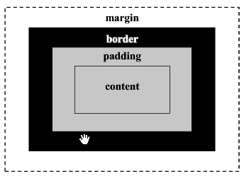
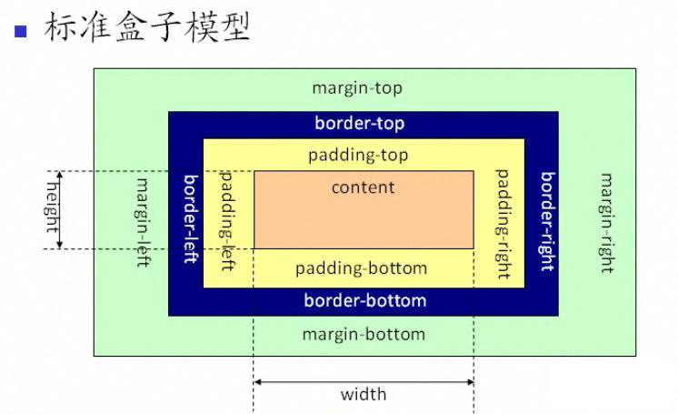
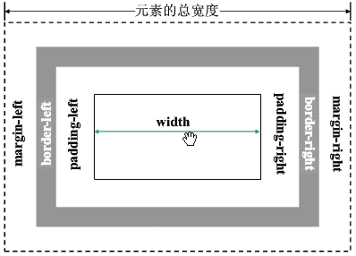
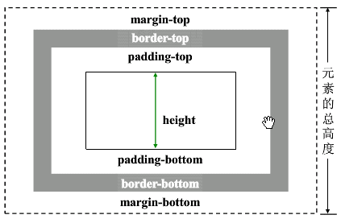

## 盒模型

```txt
盒模型是css布局的基石，它规定了网页元素如何显示以及元素间相互关系。css定义所有的元素都可以拥有像盒子一样的外形和平面空间。即都包含内容区、补白（填充）、边框、边界(外边距)这就是盒模型。
```







### padding

| padding用法: |                                                              |
| :----------: | :----------------------------------------------------------- |
|              | 1:padding是在盒子里面，在盒子与内容之间。                    |
|              | 2：padding的作用：控制子元素在父元素里面的位置关系。         |
|              | 3：padding会把盒子撑大。                                     |
|              | 4：如果想让盒子保持原有的大小：在宽高基础上减掉。（ 如果一个元素是被内容撑开的，没有设置固定的宽高，padding直接撑开。不用减掉 ） |
|              | 5:如果给单一方向添加padding                                  |
|              | padding-top/bottom/left/right                                |
|              | 6:padding的设置特点：                                        |
|              | padding:30px;    四周                                        |
|              | padding:10px 30px;     上下     左右                         |
|              | padding:10px 30px 50px    上   左右    下                    |
|              | padding:10px 30px 50px 100px     上右下左                    |
|              | 7:padding不会对背景图的位置造成影响。                        |

### margin

| margin用法    （外边距、边界） |                                                              |
| ------------------------------ | ------------------------------------------------------------ |
|                                | 1:margin在元素外围，不会撑大元素的大小                       |
|                                | 2:作用:控制元素与元素之间的间距。                            |
|                                | 3：给单一方向添加margin                                      |
|                                | margin-left/right/top/bottom                                 |
|                                | 4 :margin设置方法：                                          |
|                                | margin:30px;    四周                                         |
|                                | margin:10px 30px;     上下     左右                          |
|                                | margin:10px 30px 50px    上   左右    下                     |
|                                | margin:10px 30px 50px 100px     上右下左                     |
|                                |                                                              |
|                                | 5:margin:0 auto;                                             |
|                                | 让当前元素在父元素里面左右居中。                             |
|                                | 6:margin常出现的bug                                          |
|                                | a:两个相邻元素上下的margin值 不会叠加 按照较大值设置。       |
|                                | b:如果父元素和第一个子元素没有浮动的情况下，给第一个子元素添加margin-top,会错误放在父元素上面。 |


## 盒子大小计算 






## 文本溢出

### overflow

```txt
visible:默认值，内容不会被修剪，会呈现在元素框之外；
hidden：内容会被修剪，并且其余内容是不可见的；
scroll：内容会被修剪，但是浏览器会显示滚动条，以便查看其余的内容;
auto：如果内容被修剪，则浏览器会显示滚动条，以便查看其他的内容;
inherit：规定应该从父元素继承overflow属性的值。
```


### white-space

```txt
normal：默认值，多余空白会被浏览器忽略只保留一个；
pre：空白会被浏览器保留；
pre-wrap：保留一部分空白符序列，但是正常的进行换行；
pre-line:合并空白符序列，但是保留换行符；
nowrap:文本不会换行，文本会在同一行上继续，直到遇到<br/>标签为止;
```


### text-overflow

```txt
clip：不显示省略号（...），而是简单的裁切;
ellipsis：当对象内文本溢出时，显示省略标记；
```


#### 文本溢出变省略号设置

```txt
省略号设置：
text-overflow属性仅是：当文本溢出时是否显示省略标记，并不具备其它的样式属性定义，要实现溢出时产生省略号的效果还需定义：
1、容器宽度：width：value；（px、%，都可以）
2、强制文本在一行内显示:white-space：nowrap;
3、溢出内容为隐藏：overflow：hidden；
4、溢出文本显示省略号：
     text-overflow：ellipsis;
                        
注：必须是单行文本才能设置本文溢出！！！
```

