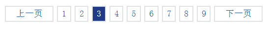
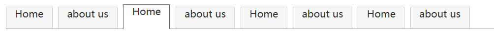
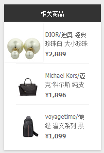

## 元素类型

```txt
根据css显示分类，XHTML元素被分为

三种类型:
	块状元素，内联元素，可变元素

&&

三种类型：	
	块状元素，内联元素，内联块元素(css2.1增加)
```


### 块状元素的特点

```txt
A:块状元素在网页中就是以块的形式显示，所谓块状就是元素显示为矩形区域，
B:默认情况下，块状元素都会占据一行，通俗地说，两个相邻块状元素不会出现并列显示的现象；默认情况下，块状元素会按顺序自上而下排列。
C:块状元素都可以定义自己的宽度和高度。 
D:块状元素一般都作为其他元素的容器，它可以容纳其它内联元素和其它块状元素。我们可以把这种容器比喻为一个子。
```


### 内联元素的特点

```txt
A:内联元素的表现形式是始终以行内逐个进行显示；
B:内联元素没有自己的形状，不能定义它的宽和高,它显示的宽度、高度只能根据所包含内容的高度和宽度来确定，它的最小内容单元也会呈现矩形形状；
C:内联元素也会遵循盒模型基本规则，如可以定义padding,border,margin,background等属性，但个别属性不能正确显示;(padding-top:;margin-top/bottom:;)
```


### 可变元素

```txt
需要根据上下文关系确定该元素是块元素或者内联元素。
```


## 常见的标签

#### 块

```txt
div -最常用的块级元素
dl - 和dt-dd 搭配使用的块级元素
form - 交互表单
h1 -h6- 大标题
hr - 水平分隔线
ol – 有序列表
p - 段落
ul - 无序列表
li
fieldset - 表单字段集
colgroup-col - 表单列分组元素
table-tr-td  表格及行-单元格
```

####  内联

```txt
a –超链接（锚点）                               
b - 粗体(不推荐) 
br - 换行                             
i - 斜体
em - 强调                             
img - 图片                         
input - 输入框               
label - 表单标签                  
span - 常用内联容器，定义文本内区块
strong - 粗体强调
sub - 下标   
sup - 上标
textarea - 多行文本输入框
u - 下划线
select - 项目选择  
```


## 元素类型的转换

### display属性

```txt
盒子模型可通过display属性来改变默认的显示类型
```


### display的属性值

| none               | 此元素不会被显示。                                           |
| ------------------ | ------------------------------------------------------------ |
| **block**          | **此元素将显示为块级元素，此元素前后会带有换行符。**         |
| **inline**         | 此元素会被显示为内联元素，元素前后没有换行符。**             |
| **inline-block**   | **行内块元素。（CSS2.1 新增的值）**                          |
| **list-item**      | **此元素会作为列表显示。**                                   |
| run-in             | 此元素会根据上下文作为块级元素或内联元素显示。               |
| compact            | CSS 中有值 compact，不过由于缺乏广泛支持，已经从 CSS2.1 中删除。 |
| marker             | CSS 中有值 marker，不过由于缺乏广泛支持，已经从 CSS2.1 中删除。 |
| table              | 此元素会作为块级表格来显示（类似 <table>），表格前后带有换行符。 |
| inline-table       | 此元素会作为内联表格来显示（类似 <table>），表格前后没有换行符。 |
| table-row-group    | 此元素会作为一个或多个行的分组来显示（类似 <tbody>）。       |
| table-header-group | 此元素会作为一个或多个行的分组来显示（类似 <thead>）。       |
| table-footer-group | 此元素会作为一个或多个行的分组来显示（类似 <tfoot>）。       |
| table-row          | 此元素会作为一个表格行显示（类似 <tr>）。                    |
| table-column-group | 此元素会作为一个或多个列的分组来显示（类似 <colgroup>）。    |
| table-column       | 此元素会作为一个单元格列显示（类似 <col>）                   |
| table-cell         | 此元素会作为一个表格单元格显示（类似 <td> 和 <th>）          |
| table-caption      | 此元素会作为一个表格标题显示（类似 <caption>）               |
| inherit            | 规定应该从父元素继承 display 属性的值。                      |


```txt
A、大部分块元素display属性值默认为block，其中列表li的默认值为list-item。
B、大部分内联元素的display属性值默认为inline,其中img,input，默认为inline-block（行内块元素）。
```


### inline-block ( 行内块元素 )

**设置一个元素在一个容器中垂直居中，必须更改默认的display属性值为inline-block;并加上同级元素（标尺）（同级元素[标尺]样式设置为vertical-align:middle;width:0;height:100%;display:inline-block;）**
	三个条件：
		1：必须给容器（父元素）加上text-align:center;
		2:必须给当前元素转成行内块元素（display:inline-block;）再给当前元素加上vertical-align:middle;
		3：在当前元素的后面（没有回车）加上同级元素span;并对span进行vertical-align:middle;width:0;height:100%;display:inline-block 


## 元素类型案例









## 置换元素

```txt
一、引题
在之前的浅谈HTML中的块级元素和内联元素中了解到了内联元素一般是不能设置宽高的，但是也有特殊。比如img是内联元素，但可以设置宽高，这肯定让不少人迷惑。这样我们就要引入HTML中置换元素的概念（非置换元素在w3c中没有给出明确的解释，姑且我们就把除置换元素外的元素当作非置换元素吧）。

二、置换元素与非置换元素
a) 置换元素：浏览器根据元素的标签和属性，来决定元素的具体显示内容。 
例如：浏览器会根据标签的src属性的值来读取图片信息并显示出来，而如果查看(x)html代码，则看不到图片的实际内容；<input>标签的type属性来决定是显示输入框，还是单选按钮等。 (x)html中的、<input>、<textarea>、<select>都是置换元素。这些元素往往没有实际的内容，即是一个空元素。

置换元素在其显示中生成了框，这也就是有的内联元素（img,input）能够设置宽高的原因。

b) 不可替换元素（非置换元素）：(x)html 的大多数元素是不可替换元素，即其内容直接表现给用户端（如浏览器）。
```


