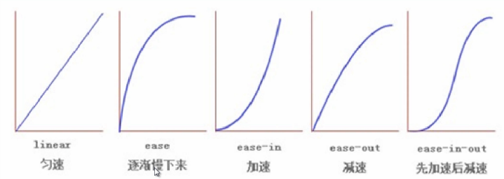
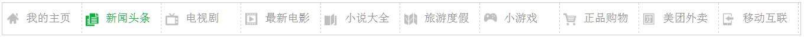

## 过渡

```txt
css3的transition允许css的属性值在一定的时间区间内平滑地过渡。这种效果可以在鼠标单击、获得焦点、被点击或对元素任何改变中触发，并圆滑地以动画效果改变CSS的属性值
```

1. transition-property：检索或设置对象中的参与过渡的属性

2. transition-duration：检索或设置对象过渡的持续时间

3. transition-delay：检索或设置对象延迟过渡的时间

4. transition-timing-function：检索或设置对象中过渡的动画类型

   ```txt
   检索或设置对象中过渡的动画类型
   http://cubic-bezier.com/
   ```

   


**简写**：transition:all/具体属性值    运动时间s/ms   延迟时间s/ms   动画类型


### 案例




