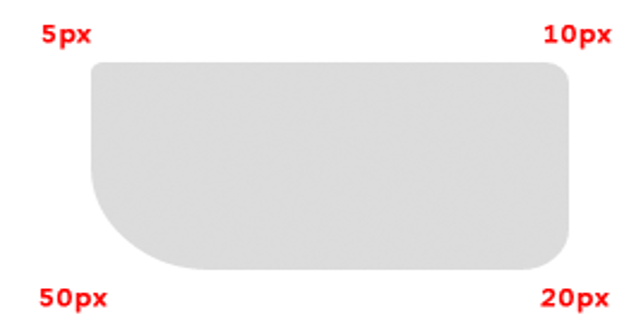
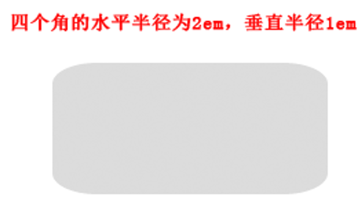
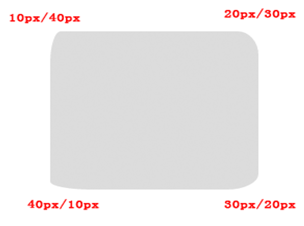

## CSS3属性

#### 文本阴影属性
+ text-shadow : offset-x | offset-y | blur-radius | color
+ 说明：水平、垂直阴影的位置允许负值
              可进行多阴影设置(逗号分隔的方式)


#### 文本换行
+ Word-wrap

  ```txt
  属性用来标明是否允许浏览器在单词内进行断句，这是为了防止当一个字符串太长而找不到它的自然断句点时产生溢出现象。
  属性值：
  	normal
  	说明：只在允许的断字点换行（浏览器保持默认处理）
  	break-word
  	说明：属性允许长单词或 URL 地址换行到下一行
  ```

+ Word-break

  ```txt
  属性值：
  	break-all
  	说明：它断句的方式非常粗暴，它不会尝试把长单词挪到下一行，而是直接进行单词内的断句
  	Keep-all
  	说明：文本不会换行，只能在半角空格或连字符处换行
  ```


#### @font-face
```txt
@font-face是CSS3中的一个模块，他主要是把自己定义的Web字体嵌入到你的网页中，随着@font-face模块的出现，我们在Web的开发中使用字体不怕只能使用Web安全字体（@font-face这个功能早在IE4就支持）
@font-face的语法规则:

```

```css
@font-face { 
	font-family: <YourWebFontName>;
	 src: <source> [<format>][, []]*; 
	[font-weight: <weight>]; 
	[font-style: <style>]; 
}
```

	iconfont字体图标库的使用


#### 背景属性
	Background-origin 背景原点（背景的起始点）
		说明：指定background-origin属性应该是相对位置
		属性值
			padding-box	背景图像填充框的相对位置
			border-box	背景图像边界框的相对位置
			content-box	背景图像的相对位置的内容框     默认值
			
	Background-clip 背景裁切
		说明：background-clip 属性规定背景的绘制区域。
		属性值
			border-box	背景被裁剪到边框盒。
			padding-box	背景被裁剪到内边距框。
			content-box	背景被裁剪到内容框。     默认值
			
	Background-size 背景尺寸
		说明：background-size 规定背景图像的尺寸
		属性值
			length	(10px)
				规定背景图的大小。第一个值宽度，第二个值高度。
			Percentage(%)
				以百分比为值设置背景图大小
			cover
				把背景图像扩展至足够大，以使背景图像完全覆盖背景区域
			contain
				把图像图像扩展至最大尺寸，以使其宽度或高度完全适应内容区域。


​				
​	css3多背景图的设置
​		eg：background:url(),url()


#### 颜色模式

```txt
	1、rgba 颜色模式
	2、 Hsl 颜色模式（了解） 
	3、 Hsla 颜色模式（了解）
	就是色调(Hue)、饱和度(Saturation)、亮度(Lightness)三个颜色通道的改变以及它们相互之间的叠加来获得各种颜色，色调(Hue)色调最大值360，饱和度和亮度有百分比表示0-100%之间。
```


#### 图片边框

```txt
图片边框
	border-image 属性是一个简写属性，用于设置以下属性:
		border-image-source	用在边框的图片的路径。
		border-image-slice	图片边框向内偏移(不加单位)。
		border-image-repeat	图像边框是否应平铺(repeat)、铺满(round)或拉伸(stretch)
		border-image-outset	边框图像区域超出边框的量(值是一个倍数)
```


#### CSS圆角

Border-radius

+ border-radius: 5px 10px 20px 50px 

  

+ border-radius: 2em/1em	

  

+ border-radius:10px 20px 30px 40px/40px 30px 20px 10px

  

#### 盒子阴影

box-shadow 盒子阴影

```txt
	h-shadow	必需的。水平阴影的位置。允许负值
	v-shadow	必需的。垂直阴影的位置。允许负值
	blur	可选。模糊距离
	spread	可选。阴影的大小
	color	可选。阴影的颜色。
	inset	可选。从外层的阴影（开始时）改变阴影内侧阴影
	box-shadow: 10px 10px 5px 10px #888888 inset;
```

+ box-shadow: 10px 10px 5px 10px #888888 inset;


#### css3 calc()方法详解

```txt
什么是calc()?
	学习calc()之前，我们有必要先知道calc()是什么？只有知道了他是个什么东东？在实际运用中更好的使用他。
	calc()从字面我们可以把他理解为一个函数function。其实calc是英文单词calculate(计算)的缩写，是css3的一个新增的功能，用来指定元素的长度。比如说，你可以使用calc()给元素的border、margin、pading、font-size和width等属性设置动态值。为何说是动态值呢?因为我们使用的表达式来得到的值。不过calc()最大的好处就是用在流体布局上，可以通过calc()计算得到元素的宽度。


calc()能做什么？
	calc()能让你给元素的做计算，你可以给一个div元素，使用百分比、em、px和rem单位值计算出其宽度或者高度，比如说“width:calc(50% + 2em)”，这样一来你就不用考虑元素DIV的宽度值到底是多少，而把这个烦人的任务交由浏览器去计算。

calc()语法
	calc()语法非常简单，就像我们小时候学加 （+）、减（-）、乘（*）、除（/）一样，使用数学表达式来表示：

	.elm {
  		width: calc(expression);
	}
	其中"expression"是一个表达式，用来计算长度的表达式。

calc()的运算规则
	calc()使用通用的数学运算规则，但是也提供更智能的功能：

	使用“+”、“-”、“*” 和 “/”四则运算；
	可以使用百分比、px、em、rem等单位；
	可以混合使用各种单位进行计算；
	表达式中有“+”和“-”时，其前后必须要有空格，如"width: calc(12%+5em)"这种没有空格的写法是错误的；
	表达式中有“*”和“/”时，其前后可以没有空格，但建议留有空格。

浏览器的兼容性
	浏览器对calc()的兼容性还算不错，在IE9+、FF4.0+、Chrome19+、Safari6+都得到较好支持，同样需要在其前面加上各浏览器厂商的识别符，不过可惜的是，移动端的浏览器还没仅有“firefox for android 14.0”支持，其他的全军覆没。
大家在实际使用时，同样需要添加浏览器的前缀
 .elm {
	/*Firefox*/
	-moz-calc(expression);
	/*chrome safari*/
	-webkit-calc(expression);
	/*Standard */
	calc();
 }
```


