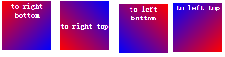

## 浏览器前缀

```txt
-ms-	   -ms-box-shadow	IE浏览器专属的CSS属性需添加-ms-前缀
-moz-	   -moz-box-shadow	所有基于Gecko引擎的浏览器（如Firefox）专属的CSS属性需添加-moz-前缀
-o-	       -o-box-shadow	Opera浏览器专属的CSS属性需添加-o-前缀
-webkit-   -webkit-box-shadow	所有基于Webkit引擎的浏览器（如Chrome、Safari）专属的CSS需添加-webkit-前缀
```

## css3 渐变

```txt
CSS3 渐变（gradient）可以让你在两个或多个指定的颜色之间显示平稳的过渡。 以前，你必须使用图像来实现这些效果，现在通过使用 CSS3 的渐变（gradients）即可实现。此外，渐变效果的元素在放大时看起来效果更好，因为渐变（gradient）是由浏览器生成的。
```

#### 线性渐变

```txt
语法：
background: linear-gradient(direction, color-stop1, color-stop2, ...);

说明：
direction：默认为to bottom，即从上向下的渐变；
stop：颜色的分布位置，默认均匀分布，例如有3个颜色，各个颜色的stop均为33.33%。
```

+ 示例1：to left、top right、to bottom、to top


+ 示例2：to right bottom、top right top、top left bottom、top left top



+ 示例3：使用角度渐变linear-gradient(10deg, red, blue)

```txt
角度是指水平线和渐变线之间的角度，逆时针方向计算。换句话说，0deg 将创建一个从下到上的渐变，90deg 将创建一个从左到右的渐变。
但是，请注意很多浏览器(Chrome,Safari,fiefox等)的使用了旧的标准，即 0deg 将创建一个从左到右的渐变，90deg 将创建一个从下到上的渐变。换算公式 90 - x = y 其中 x 为标准角度，y为非标准角度。
```


#### 径向渐变

```txt
 径向渐变不同于线性渐变，线性渐变是从“一个方向”向“另一个方向”的颜色渐变，而径向渐变是从“一个点”向四周的颜色渐变
```

```txt
语法：
     background: radial-gradient(center, shape, size, start-color, ..., last-color);
说明：
center：渐变起点的位置，可以为百分比，默认是图形的正中心。
shape：渐变的形状，ellipse表示椭圆形，circle表示圆形。默认为ellipse，如果元素形状为正方形的元素，则ellipse和circle显示一样。
size：渐变的大小，即渐变到哪里停止，它有四个值。 closest-side：最近边； farthest-side：最远边； closest-corner：最近角； farthest-corner：最远角。
```

+ 示例1：多颜色节点均匀分布

```css
div { background: -webkit-radial-gradient(50% 50%, farthest-corner, red, green, blue); } 
div { background: -webkit-radial-gradient(center, farthest-corner, red, green, blue); }
```

+ 示例2：多颜色节点均匀分布

```css
div { background: radial-gradient(circle, red, yellow, green); } 
div { background: radial-gradient(ellipse, red, yellow, green); }
```

+ 示例3：设置渐变形状

```txt
circle：渐变为最大的圆形； ellipse：根据元素形状渐变，元素为正方形是显示效果与circle无异
```

​		

+ 示例4：不同尺寸的渐变

```css
div { background: radial-gradient(60% 40%, closest-side, blue, green, yellow, black); } 
div { background: radial-gradient(60% 40%, farthest-side, blue, green, yellow, black); }
div { background: radial-gradient(60% 40%, closest-corner, blue, green, yellow, black); }
div { background: radial-gradient(60% 40%, farthest-corner, blue, green, yellow, black);}
```


