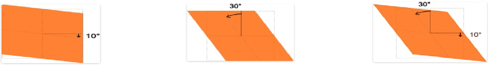
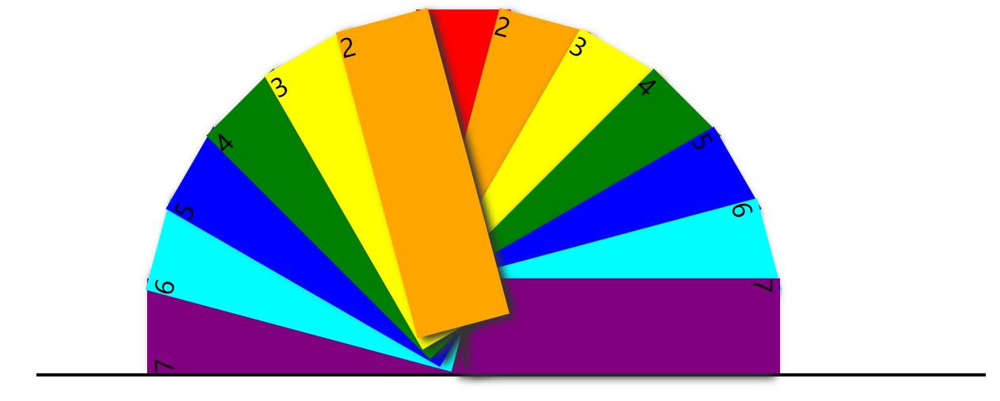

# 变形属性：transform

```txt
transform翻译成汉语具有"变换"或者"改变"的意思。
通过此属性具有非常强大的功能，比如可以实现元素的位移、拉伸或者旋转等效果
最能体现transform 属性强大实力的是实现元素的3D变换效果。
```


# 2D

```txt
2D变换，是在一个平面对元素进行的操作。
可以对元素进行水平或者垂直位移、旋转或者拉伸.
```

+ 明确一下坐标系

  

```txt
对上面坐标系简单分析如下：
（1）.默认状态下，x轴是水平的，向右为正。
（2）.默认状态下，y轴是垂直的，向下为正，这与传统的数学坐标系不同。
```


## 2D功能函数

### 2D位移 translate()

+ 将元素向指定的方向移动，类似于position中的relative。
+ 水平移动：向右移动translate(tx,0)和向左移动translate(-tx,0)；
+ 垂直移动：向上移动translate(0,-ty)和向下移动translate(0,ty);
+ 对角移动：右下角移动translate(tx,ty)、右上角移动translate(tx,-ty)、左上角移动translate(-tx,-ty)和左下角移动translate(-tx,ty)。


### 2D缩放scale()

+ 让元素根据中心原点对对象进行缩放。默认的值1。因此0.01到0.99之间的任何值，使一个元素缩小；而任何大于或等于1.01的值，让元素显得更大。

+ 缩放scale()函数和translate()函数的语法非常相似，他可以接受一个值，也可以同时接受两个值，如果只有一个值时，其第二个值默认与第一个值相等。例如，scale(1,1)元素不会有任何变化，而scale(2,2)让元素沿X轴和Y轴放大两倍。

+ scaleX()：相当于scale(sx,1)。表示元素只在X轴（水平方向）缩放元素，其默认值是1。

+ scaleY()：相当于scale(1,sy)。表示元素只在Y轴（纵横方向）缩放元素，其默认值是１。


### 3、rotate()
	旋转rotate()函数通过指定的角度参数对元素根据对象原点指定一个2D旋转。它主要在二维空间内进行操作，接受一个角度值，用来指定旋转的幅度。如果这个值为正值，元素相对原点中心顺时针旋转；如果这个值为负值，元素相对原点中心逆时针旋转。
	 rotateX() 方法，元素围绕其 X 轴以给定的度数进行旋转
	 rotateY() 方法，元素围绕其 Y 轴以给定的度数进行旋转


### 4、skew()
	倾斜skew()函数能够让元素倾斜显示。它可以将一个对象以其中心位置围绕着X轴和Y轴按照一定的角度倾斜。
	一个参数时：表示水平方向的倾斜角度；
	两个参数时：第一个参数表示水平方向的倾斜角度，第二个参数表示垂直方向的倾斜角度




## 变形原点

```txt
transform-origin
	transform-origin是变形原点，也就是该元素围绕着那个点变形或旋转，该属性只有在设置了transform属性的时候起作用；
	因为我们元素默认基点就是其中心位置，换句话说我们没有使用transform-origin改变元素基点位置的情况下，transform进行的rotate,translate,scale,skew等操作都是以元素自己中心位置进行变化的。
```


## 2d案例




