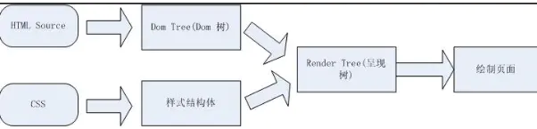

# 优化
1）页面主题优化

```
实事求是的写下自己网站的名字，网站的名字要合理，最好包含网站的主要内容。
```

2）页面头部优化

```html
<meta name="keywords"   content="" />向搜索引擎说明你的网页的关键词；
<meta name="description"    content=""/>告诉搜索引擎你的站点的主要内容；
```

```
说明
	1、“描述”部分应该用近乎描述的语言写下一段介绍你网站的文字，在这其中，你应该适当的对你网站的特色内容加以重复以求突出；
	2、“关键字”部分应该列出你认为合适的，能突出网站内容的关键字就可以了，关键字不要设置太多，可设置10---8个，搜索引擎只会浏览靠前的几个关键字。
```

3）超链接优化

```
1、采用纯文本链接，少用，最好是别用Flash动画设置链接，因为搜索引擎无法识别Flash上的文字.
2、按规范书写超链接，这个title属性，它既可以起到提示访客的作用，也可以让搜索引擎知道它要去哪里.
3、最好别使用图片热点链接，理由和第一点差不多
```

4）图片优化

```
图片优化并不是修改图片的大小、颜色，而是你应该为每个标签加上alt属性，alt属性的作用是当图片无法显示时以文字作为替代显示出来，而对于SEO来说，它可以令搜索引擎有机会索引你网站上的图片，对于一些确实没什么意义的图片，最好也不要省略alt，而应该留空，即 alt=""。
```

5）PageRank（pr值,友情链接）

```
PR值是Google提出的一个重要参数，它标明了某个网站的重要程度，那么pr值是如何确定的呢？目前普通的解释为：假如有ABC三个网站，彼此互作友情链接，那么当一个访客通过A上的友情链接来到B时，Google就认为A为B投了“一票”，同理，如果有人从C访问B，那么B又得一票，如果全世界的网站上都有B的友情链接，B就是世界上最重要的网站了！
```


## 可以扩展：回流(resflow)  & 重绘(repaint)

+ 页面的渲染流程



```
什么是DOM树
什么是样式结构体
什么是呈现树

呈现树的特点  
```

