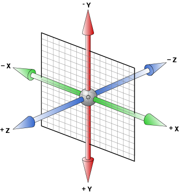
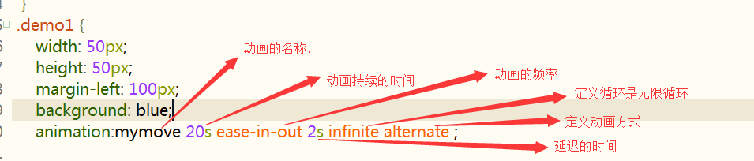
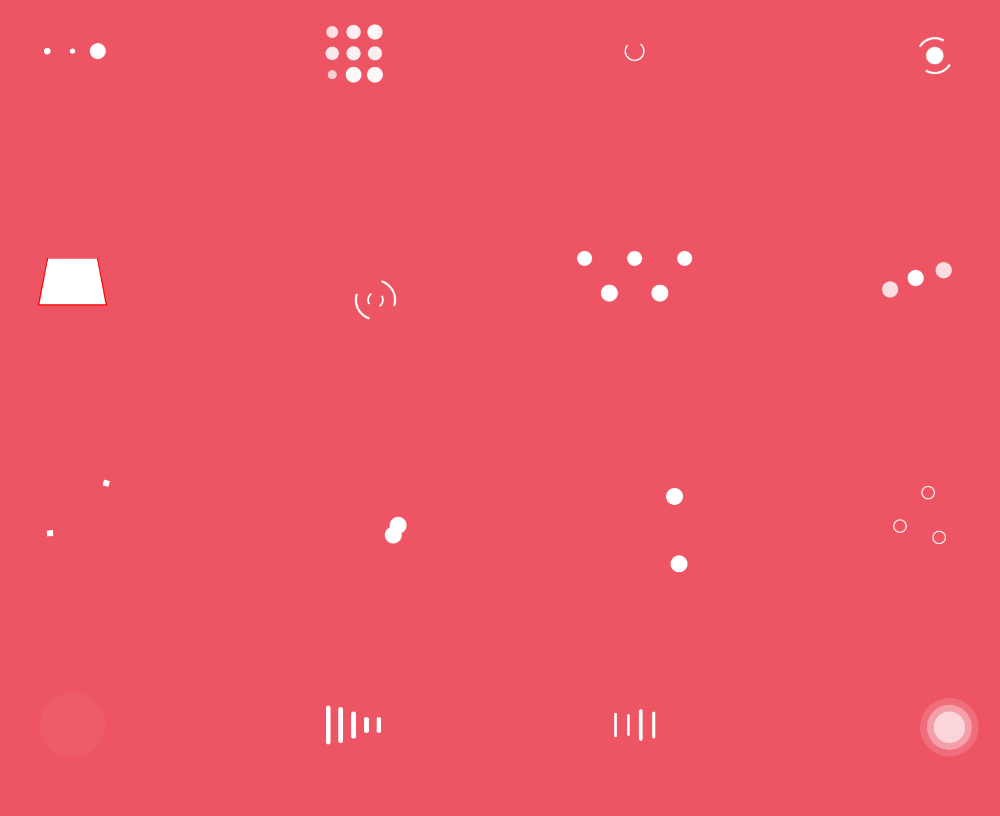
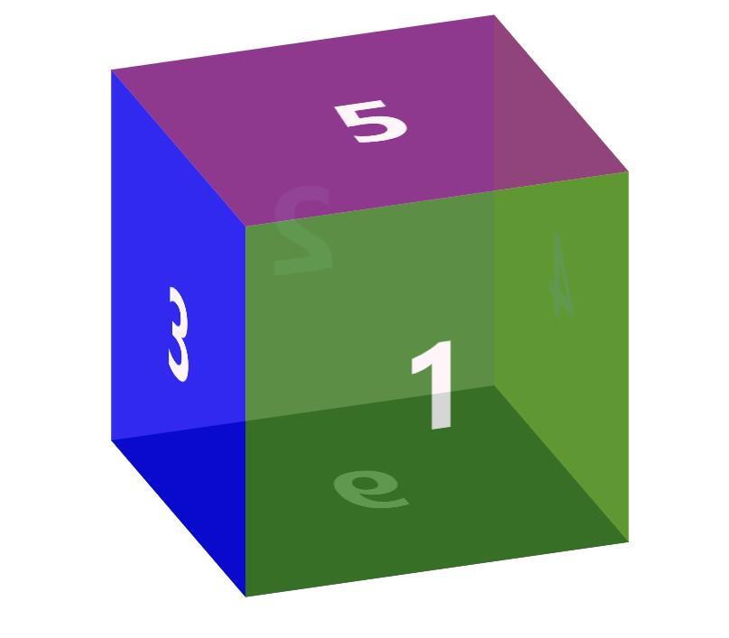

# css3 3D
> 其实css3的 3d效果主要是依赖带有z轴的 `translate3d` 属性来实现的， 弄清楚x，y，z轴就可以掌握3d技术

- x,y,z轴 : 

;

# css3动画

```txt
通过 CSS3，我们能够创建动画，这可以在许多网页中取代动画图片、Flash 动画以及 JavaScript。
```


## 关键帧的定义

```txt
不同于过渡动画只能定义首尾两个状态，关键帧动画可以定义多个状态，或者用关键帧的话来说，过渡动画只能定义第一帧和最后一帧这两个关键帧，而关键帧动画则可以定义任意多的关键帧，因而能实现更复杂的动画效果。
```

```css
@keyframes mymove{
 from{初始状态属性}
to{结束状态属性}
}
或
@keyframes mymove{
 0%{初始状态属性}
50%（中间再可以添加关键帧）
100%{结束状态属性}
}
```




## animation  vs  transition

+ 相同点：都是随着时间改变元素的属性值。
+ 不同点：transition需要触发一个事件(hover事件或click事件等)才会随时间改变其css属性；
  而animation在不需要触发任何事件的情况下也可以显式的随着时间变化来改变元素css的属性值，从而达到一种动画的效果，css3的animation就需要明确的动画属性值


### animation

+ animation-name
  + 检索或设置对象所应用的动画名称
  + 必须与规则@keyframes配合使用，
    eg:@keyframes mymove{}  animation-name:mymove;
+ animation-duration 
  - 检索或设置对象动画的持续时间
  - 说明：animation-duration:3s;    动画完成使用的时间为3s
+ animation-timing-function 
  - 检索或设置对象动画的过渡类型
  - 属性值
    - linear：线性过渡。等同于贝塞尔曲线(0.0, 0.0, 1.0, 1.0)
    -  ease：平滑过渡。等同于贝塞尔曲线(0.25, 0.1, 0.25, 1.0)
    -  ease-in：由慢到快。等同于贝塞尔曲线(0.42, 0, 1.0, 1.0)
    -  ease-out：由快到慢。等同于贝塞尔曲线(0, 0, 0.58, 1.0)
    - ease-in-out：由慢到快再到慢。等同于贝塞尔曲线(0.42, 0, 0.58, 1.0)
    - step-start:马上跳到动画每一结束桢的状态
+ animation-delay
  + 检索或设置对象动画延迟的时间
  + 说明：animation-delay:0.5s;     动画开始前延迟的时间为0.5s)
+ animation-iteration-count 
  + 检索或设置对象动画的循环次数
  + 属性值
    + animation-iteration-count: infinite | number;
    + infinite：无限循环
    + number: 循环的次数
+ animation-direction 
  + 检索或设置对象动画在循环中是否反向运动
  + 属性值
    + normal：正常方向
    + reverse：反方向运行
    + alternate：动画先正常运行再反方向运行，并持续交替运行
    + alternate-reverse：动画先反运行再正方向运行，并持续交替运行
+ animation-play-state 
  + 检索或设置对象动画的状态
  + 属性值
    + animation-play-state:running | paused;
    +  running:运动
    + paused: 暂停
    + animation-play-state:paused;       当鼠标经过时动画停止，鼠标移开动画继续执行


#### 简写




#### 动画案例

逐帧动画




#### 动画 & 3D  案例


