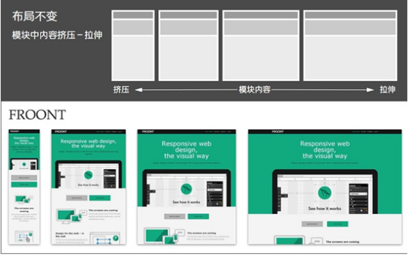
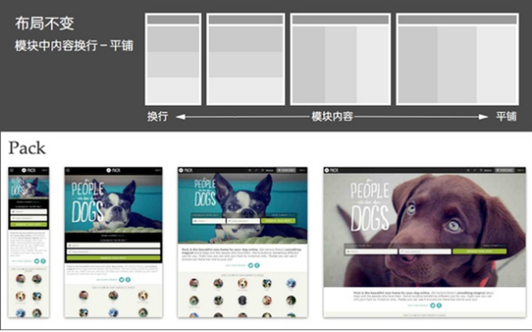
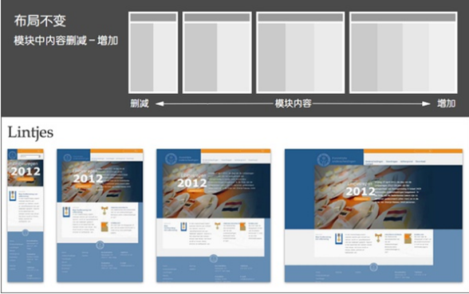
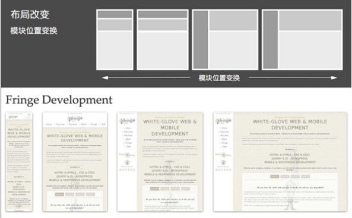
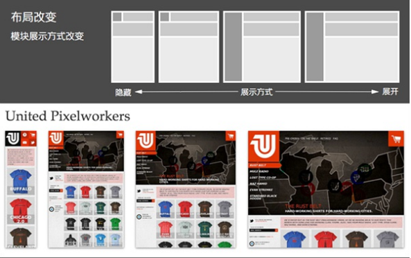
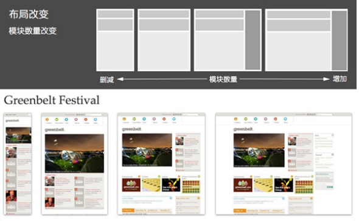

## 常见的布局方案

```txt
固定布局：以像素作为页面的基本单位，不管设备屏幕及浏览器宽度，只设计一套尺寸；

可切换的固定布局：同样以像素作为页面单位，参考主流设备尺寸，设计几套不同宽度的布局。通过识别的屏幕尺寸或浏览器宽度，选择最合适的那套宽度布局；

弹性布局：以百分比作为页面的基本单位，可以适应一定范围内所有尺寸的设备屏幕及浏览器宽度，并能完美利用有效空间展现最佳效果；

混合布局：同弹性布局类似，可以适应一定范围内所有尺寸的设备屏幕及浏览器宽度，并能完美利用有效空间展现最佳效果；只是混合像素、和百分比两种单位作为页面单位。


布局响应：对页面进行响应式的设计实现，需要对相同内容进行不同宽度的布局设计，有两种方式：pc优先（从pc端开始向下设计）；移动优先（从移动端向上设计）；无论基于那种模式的设计，要兼容所有设备，布局响应时不可避免地需要对模块布局做一些变化（发生布局改变的临界点称之为断点），
```

### 常见响应式布局方案

+ （1）模块中内容：挤压－拉（布局不变）

  

+ （2）模块中内容：换行－平铺（布局不变）

  

+ （3）模块中内容：删减－增加（布局不变）

  

+ （4）模块位置变换（布局改变）

  

+ （5）模块展示方式改变：隐藏－展开（布局改变）

  

+ （6）模块数量改变：删减－增加（布局改变）

  

## 响应式开发的特点

```txt
设计特点：
	面对不同分辨率设备灵活性强 
	能够快捷解决多设备显示适应问题
```

```
缺点：
	兼容各种设备工作量大，效率低下
	代码累赘，会出现隐藏无用的元素，加载时间加长
	其实这是一种折中性质的设计解决方案，多方面因素影响而达不到最佳效果
	一定程度上改变了网站原有的布局结构，会出现用户混淆的情况
```

