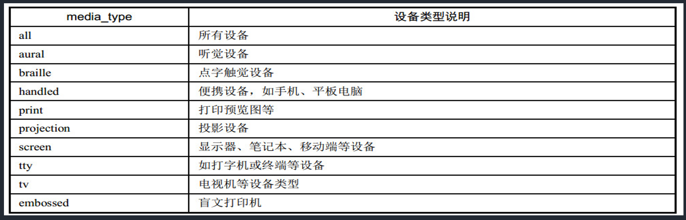
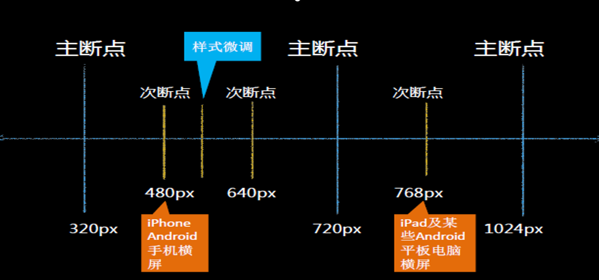

## 媒体查询

```txt
媒体查询可以让我们根据设备显示器的特性（如视口宽度、屏幕比例、设备方向：横向或纵向）为其设定CSS样式，媒体查询由媒体类型和一个或多个检测媒体特性的条件表达式组成。媒体查询中可用于检测的媒体特性有 width 、 height 和 color （等）。使用媒体查询，可以在不改变页面内容的情况下，为特定的一些输出设备定制显示效果。
```

### 语法

```css
@media all and (min-width:320px) { 
	body { background-color:blue;}
 }
```

#### 设备类型(默认值为all)




#### 关键字

```
screen 是媒体类型里的一种，CSS2.1定义了10种媒体类型
and 被称为关键字，其他关键字还包括 not(排除某种设备)，only(限定某种设备)
(min-width: 400px) 就是媒体特性，其被放置在一对圆括号中。
```

#### 常见适配范围

```txt
设备范围
	默认样式    注意：默认样式要写在最前面
	/* 打印样式 */
		@media print {}
	/* 手机等小屏幕手持设备 */
		@media screen and (min-width: 320px) and (max-width: 480px) {}
	/* 平板之类的宽度 1024 以下设备 */
		@media only screen and (min-width: 321px) and (max-width: 1024px) {}
	/* PC客户端或大屏幕设备: 1028px 至更大 */
		@media only screen and (min-width: 1029px) {}
	/* 竖屏 */
		@media screen and (orientation:portrait) {对应样式}
	/* 横屏 */
		@media screen and (orientation:landscape){对应样式}
```


