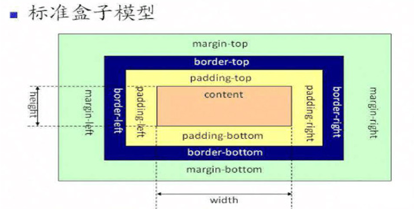
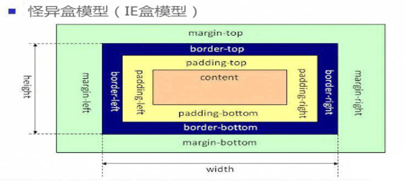
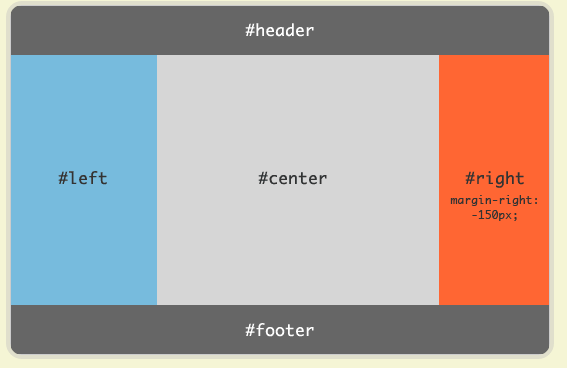

## 怪异盒模型

+  box-sizing

```txt
content-box
		这是由 CSS2.1 规定的宽度高度行为。宽度和高度分别应用到元素的内容框。在宽度和高度之外绘制元素的内边距和边框。
```



	border-box
		为元素设定的宽度和高度决定了元素的边框盒。就是说，为元素指定的任何内边距和边框都将在已设定的宽度和高度内进行绘制。通过从已设定的宽度和高度分别减去边框和内边距才能得到内容的宽度和高度。




## FLEX布局

```txt
Flex容器：采用 Flex 布局的元素的父元素；
Flex项目：采用 Flex 布局的元素的父元素的子元素；
容器默认存在两根轴：水平的主轴（main axis）和垂直的交叉轴（cross axis）。主轴的开始位置（与边框的交叉点）叫做main start，结束位置叫做main end；交叉轴的开始位置叫做cross start，结束位置叫做cross end。
项目默认沿主轴排列。单个项目占据的主轴空间叫做main size，占据的交叉轴空间叫做cross size。
```




#### flex容器属性

​	1、display:flex、inline-flex

```txt
注意，设为 Flex 布局以后，子元素的float、clear和vertical-align属性将失效。
```

​	2、flex-direction属性 决定主轴的方向（即项目的排列方向）

```
flex-direction: row | row-reverse | column | column-reverse;
```

​	3、flex-wrap属性，定义子元素是否换行显示

```
flex-wrap: nowrap | wrap | wrap-reverse;
```

​	4、 flex-flow 

```
flex-flow属性是flex-direction属性和flex-wrap属性的简写形式，默认值为row nowrap;
```

​	5、 justify-content属性 定义了项目在主轴（）上的对齐方式。

```
justify-content: flex-start | flex-end | center | space-between | space-around;
```

​	6、align-items属性定义项目在交叉轴上如何对齐。

```
align-items: flex-start | flex-end | center | baseline | stretch（默认值）;
```

​	7、align-content属性定义了多根轴线的对齐方式。对于单行子元素，该属性不起作用。

```
align-content: flex-start | flex-end | center | space-between | space-around | stretch;
align-content在侧轴上执行样式的时候，会把默认的间距给合并。对于单行子元素，该属性不起作用
```


#### flex项目属性

1、align-self属性

```txt
Internet Explorer 和 Safari 浏览器不支持 align-self 属性
说明：
	align-self 属性规定灵活容器内被选中项目的对齐方式。
	注意：align-self 属性可重写灵活容器的 align-items 属性。
	属性值
		auto 		默认值。元素继承了它的父容器的 align-items 属性。如果没有父容器则为 "stretch"。
		Stretch		元素被拉伸以适应容器。
		Center		元素位于容器的中心。
		flex-start		元素位于容器的开头。
		flex-end		元素位于容器的结尾。
```

2、order

```
说明：
	number排序优先级，数字越大越往后排，默认为0，支持负数。
```

3、flex

```
说明：
	复合属性。设置或检索弹性盒模型对象的子元素如何分配空间
	详细属性值：
		缩写「flex: 1」, 则其计算值为「1 1 0%」
		缩写「flex: auto」, 则其计算值为「1 1 auto」
		flex: none」, 则其计算值为「0 0 auto」
		flex: 0 auto」或者「flex: initial」, 则其计算值为「0 1 auto」，即「flex」初始值
```

4、flex-xxx

```
flex-grow
	一个数字，规定项目将相对于其他灵活的项目进行扩展的量。
flex-shrink
	一个数字，规定项目将相对于其他灵活的项目进行收缩的量。
flex-basis
	项目的长度
```


### flex布局案例




